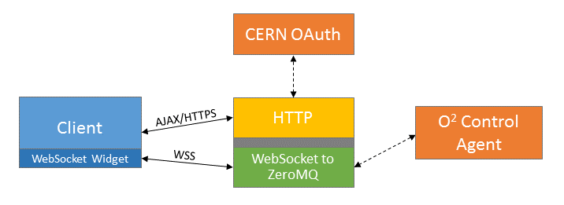
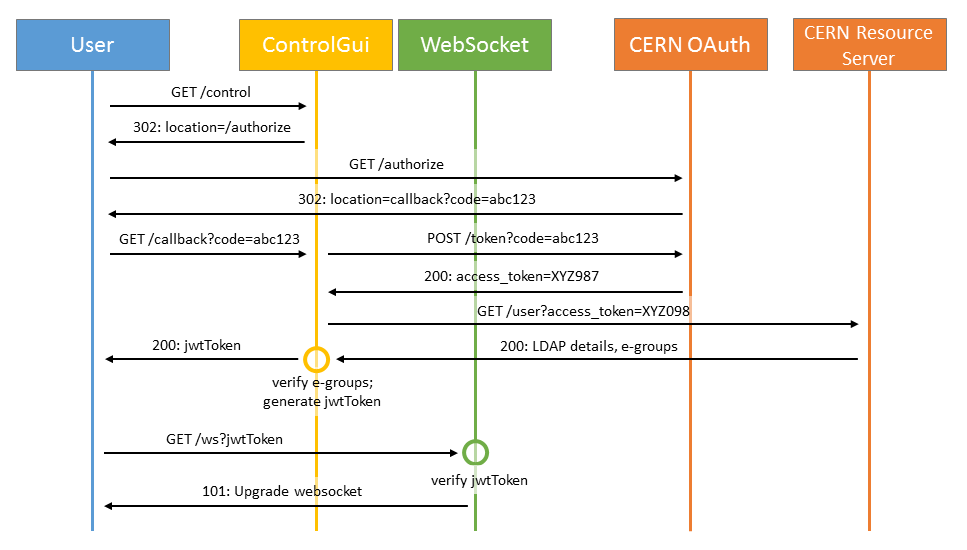

# Prototype of Control GUI
The goal of Prototype Control GUI is to identify library and framework sets and develope the core functionalities of common O2 Web Applications:
- Server-side (node.js)
  - HTTPS / REST API
  - Authentication via CERN OAuth 2 and authorization via e-groups
- WebSocket (node.js)
  - WebSocket server that can communicate with C++ processes via ZeroMQ (C++ library available)
  - Custom WebSocket authentication based on JSON Web Tokens
- Front-end (JavaScript/jQuery)
  - Core modules as custom jQuery widgets

## Architecture


## Authentication and authorization flow


## Control specific functionality developed so far
1. Padlock module - only single user that owns lock is allowed to execute commands, other connected users act as spectators

## Installation
1. Install ZeroMQ > 4.0
2. Clone repository
     ```
     git clone https://github.com/AliceO2Group/ControlGui && cd ControlGui
     ```
3. Install dependecies
     ```
     npm install
     ```

### ZeroMQ custom installation
If you've installed ZeroMQ under custom path, npm install will fail with : *fatal error: zmq.h: No such file or directory*
To solve this issue you need to recompile zmq module.

1. Go to ControGui directory
2. Download zmq modue
     ```
     curl `npm v zmq dist.tarball` | tar xvz && mv package/ node_modules/zmq/
     ```
3. Add ZeroMQ include directory to *node_modules/zmq/binding.gyp* file after line 67
     ```
     '-I/<ZeroMQPath>/include/'
     ```
4. Run again 
    ```
    npm install
    ```

## Configuration file
Edit config.json and recplace &lt;tags&gt; with corresponding data:
1. jwtSecret   -  Specify JWT secret passphrase
2. oAuthSecret -  OAuth secret
3. host        -  OAuth hostname
4. appHost     -  Hostname you are running application on
5. privateKey  -  Private key path
6. certificate -  PEM ceritficate path
7. pushServer  -  hostname that pushes commands
8. replyServer -  hostname that replies to your requests

## Run
```
node app.js
```
